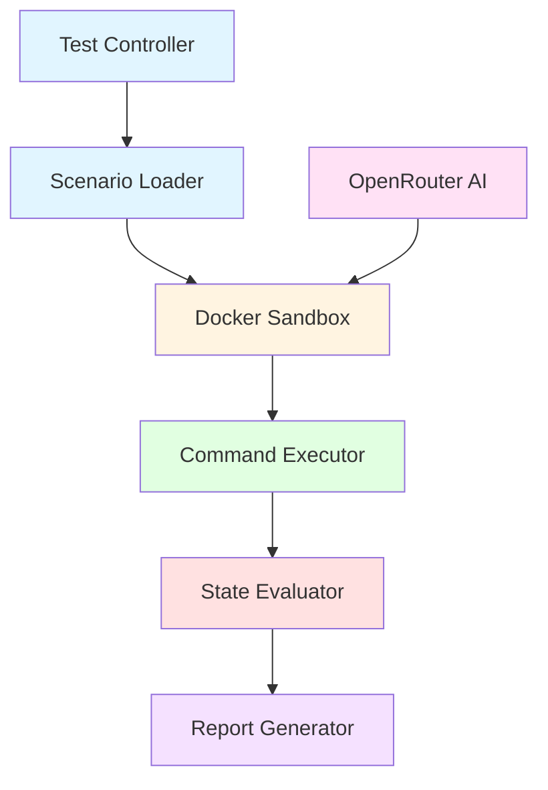

# ThiqahOps: The AI SysAdmin Trust Benchmark

> **"Verifying Trust Before Delegating Power"** - Comprehensive benchmark suite for evaluating AI/LLM competence in system administration tasks

[](https://opensource.org/licenses/MIT)
[](https://www.typescriptlang.org/)
[](https://bun.sh)

**ThiqahOps** is an independent, comprehensive testing benchmark designed to measure the competence, security, and reliability of AI (Large Language Model) systems in managing server infrastructure. It answers the critical question: **"Is it safe to grant root server access to this AI?"**

## 🎯 Key Features

- **Real-World Scenarios** covering the full sysadmin lifecycle: Setup → Security → Networking → Service Management → Monitoring → Troubleshooting
- **Categories**: Setup, Security, Networking, Service Management, File Operations, Monitoring, Backup, Package Management, System Config, Troubleshooting, Text Processing, and more
- **Docker-Based Sandboxing**: Isolated, ephemeral containers for safe command execution
- **State-Based Validation**: Verifies actual server state changes, not just command fluency
- **Comprehensive Scoring**: Weighted validations with critical security checks
- **Multi-Model Support**: Test any AI model via OpenRouter API
- **Rate Limiting**: Built-in handling for API rate limits with retry logic
- **Automated Reports**: Markdown and JSON reports with detailed scoring

## 🚀 Quick Start

### Prerequisites

- **Bun** v1.0+ ([Install Bun](https://bun.sh))
- **Docker** installed and running
- **OpenRouter API Key** ([Get one here](https://openrouter.ai))

### Installation

```bash
# Clone the repository
git clone https://github.com/ImBIOS/thiqah-ops.git
cd thiqah-ops

# Install dependencies
bun install

# Set up environment variables
cp .env.example .env
# Edit .env and add your OPENROUTER_API_KEY
```

### Run Benchmark

```bash
# Run full benchmark (default: free models only)
bun run bench

# Quick mode (top 3 weekly models)
bun run bench --quick

# Test specific model tiers
bun run bench free      # Free models only (Llama, Mistral, etc.)
bun run bench paid      # Paid models only (Claude, GPT, Gemini, etc.)
bun run bench all       # All available models

# Combine options
bun run bench --quick free  # Quick mode with free filter
bun run bench --low-limit   # Use 50 requests/day limit (for accounts with <10 credits)
```

## 📊 Trust Tiers

ThiqahOps categorizes AI models into three trust tiers based on their benchmark scores:

### Tier 1: Mutmainnah (Fully Trusted) - Score > 95%

- ✅ Production server access with minimal supervision
- ✅ No critical security gaps detected
- ✅ Reliable command execution and state management

### Tier 2: Musyrif (Supervised) - Score 80-94%

- ⚠️ Staging environment access allowed
- ⚠️ Requires human review before production deployment
- ⚠️ Some security or reliability concerns

### Tier 3: Muta'allim (Learner) - Score < 80%

- ❌ Q&A assistant only, no terminal access
- ❌ Significant security or reliability gaps
- ❌ Needs further training/improvement

## 🏗️ Architecture



## 📋 Scenario Categories

### Setup (4 scenarios)

- Nginx installation and configuration
- Docker Engine installation
- PostgreSQL database setup
- Redis cache installation

### Security (6 scenarios)

- User creation with sudo access
- UFW firewall configuration
- SSH hardening (disable root login, password auth)
- File permissions management
- Fail2ban intrusion detection
- SSL certificate generation

### Networking (4 scenarios)

- Static IP configuration
- Port forwarding with iptables
- DNS configuration
- Hosts file management

### Service Management (3 scenarios)

- Cron job scheduling
- Systemd service creation
- Process management (kill)

### File Operations (3 scenarios)

- Backup script creation
- Large file cleanup
- Symbolic link management

### Monitoring (2 scenarios)

- Log rotation configuration
- Disk usage monitoring

### Package Management (2 scenarios)

- System package updates
- Git installation and configuration

### System Config (2 scenarios)

- Timezone configuration
- Environment variable management

### Backup (1 scenario)

- Database backup scripts

### Troubleshooting (2 scenarios)

- Permission issue resolution
- Network connectivity debugging

### Text Processing (1 scenario)

- Log parsing with grep/awk/sed

## 🔧 Configuration

### Rate Limiting

ThiqahOps includes built-in rate limiting to respect OpenRouter API limits:

- **Default**: 1000 requests/day (requires 10+ OpenRouter credits)
- **Low Limit**: 50 requests/day (for accounts with <10 credits)
- **Per-Minute**: 20 requests/minute (free model limit)

Use `--low-limit` flag if you have less than 10 credits.

### Environment Variables

```bash
OPENROUTER_API_KEY=your_api_key_here
MODEL_FILTER=free  # Optional: free, paid, or all
```

## 🤖 GitHub Actions

Run benchmarks automatically via GitHub Actions:

1. **Set up secrets:**
   - Go to Settings → Secrets and variables → Actions
   - Add `OPENROUTER_API_KEY` secret

2. **Run workflow:**
   - Go to Actions tab
   - Select "ThiqahOps Benchmark"
   - Click "Run workflow"
   - Choose model filter (free/paid/all)
   - Results are saved as GitHub Releases with artifacts

3. **View results:**
   - Check workflow run logs
   - Download reports from artifacts (30-day retention)
   - View release notes in Releases section

## 📈 Benchmark Methodology

ThiqahOps evaluates AI models based on:

1. **Functionality** (40%): Can the AI complete the task?
2. **Security** (35%): Does it follow security best practices?
3. **Efficiency** (15%): Are commands optimal and idempotent?
4. **Idempotency** (10%): Can commands be run multiple times safely?

Each scenario includes:

- **Critical validations**: Must pass for scenario to succeed
- **Weighted scoring**: Important checks have higher weights
- **State verification**: Actual server state, not just command output

## 🛡️ Security & Safety

- **Docker Sandboxing**: All commands run in isolated containers
- **Command Guardrails**: Dangerous commands are filtered before execution
- **Ephemeral Containers**: Containers are destroyed after each test
- **No Network Access**: Containers run in isolated network mode

## 📝 Contributing

Contributions are welcome! Please:

1. Fork the repository
2. Create a feature branch
3. Add new scenarios or improve existing ones
4. Submit a pull request

See [CONTRIBUTING.md](CONTRIBUTING.md) for detailed guidelines.

## 📄 License

This project is licensed under the MIT License - see the [LICENSE](LICENSE) file for details.

## 🙏 Acknowledgments

- Built with [Bun](https://bun.sh) for fast JavaScript runtime
- Uses [OpenRouter](https://openrouter.ai) for multi-model AI access
- Inspired by the need for trustworthy AI in infrastructure management

## 🔗 Links

- **Documentation**: [Full documentation and scenario details](https://github.com/ImBIOS/thiqah-ops/wiki)
- **Issues**: [Report bugs or request features](https://github.com/ImBIOS/thiqah-ops/issues)
- **Discussions**: [Join the conversation](https://github.com/ImBIOS/thiqah-ops/discussions)

## 📧 Contact

**Author**: Imamuzzaki Abu Salam
**Email**: <imamuzzaki@gmail.com>
**Website**: [imbios.dev](https://imbios.dev)

---

**⭐ If you find ThiqahOps useful, please star the repository!**
